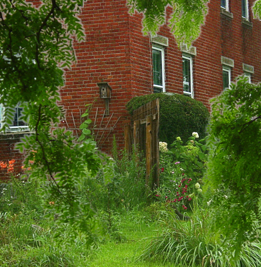

# Haze removal using Dark channel prior [](https://travis-ci.org/mshr-h/Image_Dehazing)
## Description
This is an implementation of dehaze(haze removal) algorithm using C/C++ on Qt platform.
The algorithm is written in C.

## What's the Dehaze
Dehaze is a technique to improve the visibility of the outdoor images.

## Example
| hazy image |  output |
| :--------: | :-----: |
|  |  |
- window size=5x5 pixels
- ω=0.95
- t_0=0.01
- p=0.1

## Requirement
- Qt 5.3 or newer (probably works on older than 5.3 but not tested)

## Directory tree
```
include/      header files
inImg_db/     example input images
lib_c/        C code
lib_qc/       C structure <-> C++ data conversion
outImg_db/    example output images
```

## Reference
[Kaiming He, Jian Sun, Xiaoou Tang, "Single image haze removal using dark channel prior", CVPR, 2009, 2013 IEEE Conference on Computer Vision and Pattern Recognition, 2013 IEEE Conference on Computer Vision and Pattern Recognition 2009, pp. 1956-1963, doi:10.1109/CVPRW.2009.5206515](http://research.microsoft.com/en-us/um/people/jiansun/papers/Dehaze_CVPR2009.pdf)
